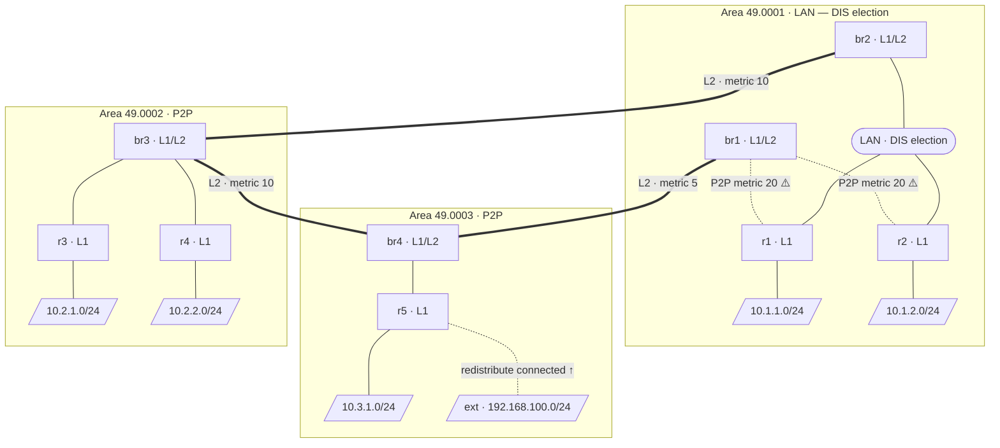

# netlab-isis-lab

[](https://codespaces.new/severindellsperger/netlab-isis-lab?machine=basicLinux32gb&devcontainer_path=.devcontainer/devcontainer.json)

A hands-on lab that uses [NetLab](https://netlab.tools) and [Containerlab](https://containerlab.dev) with [Nokia SR Linux](https://learn.srlinux.dev) containers to demonstrate IS-IS multi-area routing, DIS election, pseudo-nodes, suboptimal inter-area routing, route leaking, and redistribution of external routes — all in a single reproducible topology.

> **No manual image download required.** Nokia SR Linux images are publicly available and pulled automatically by Containerlab on first launch.

---

## Lab Topology



> ⚠️ **Suboptimal routing highlighted:** `r1`/`r2` prefer `br2` as their L1 default gateway
> (lower L1 cost — `br2` is reachable via the LAN at metric 10) but the shortest end-to-end
> path to Area 3 goes via `br1` (P2P metric 20 + direct L2 link metric 5 = 25, vs 10+10+10=30
> via `br2`). See the [Suboptimal Inter-Area Routing](#suboptimal-inter-area-routing) section for details
> and the [Route Leaking](#route-leaking--fixing-suboptimal-routing) section for the fix.

> **Note:** In IS-IS there is no concept of an ABR (Area Border Router — that is OSPF terminology).
> The routers participating in both L1 and L2 are simply called **L1/L2 routers** or **border routers** (`br1`–`br4`).

| Router | IS-IS Level | Area | Attached stub network |
|--------|-------------|------|-----------------------|
| `r1` | L1 only | 49.0001 | `10.1.1.0/24` |
| `r2` | L1 only | 49.0001 | `10.1.2.0/24` |
| `br1` | L1/L2 border | 49.0001 ↔ L2 | — |
| `br2` | L1/L2 border | 49.0001 ↔ L2 | — |
| `r3` | L1 only | 49.0002 | `10.2.1.0/24` |
| `r4` | L1 only | 49.0002 | `10.2.2.0/24` |
| `br3` | L1/L2 border | 49.0002 ↔ L2 | — |
| `r5` | L1 only | 49.0003 | `10.3.1.0/24` |
| `br4` | L1/L2 border | 49.0003 ↔ L2 | — |
| `ext` | **no IS-IS** | — (external host) | `192.168.100.0/24` *(redistributed from r5)* |

> **Note on IP addresses:** NetLab auto-assigns addresses from its default pools.
> Loopbacks use `10.0.0.x/32` and transit links use `172.16.x.x`. Run `netlab up`
> and inspect `netlab.yml` for the exact assigned addresses.

---

## IS-IS Concepts Explained

### Level-1 (L1) — Intra-area Routing

A **Level-1** router knows only about routers and prefixes *within its own area*.
It builds an intra-area **L1 LSDB** from:
- **Type 1 LSPs** (router LSPs) — one per router in the area, describing its links and reachable prefixes.
- **Type 2 LSPs** (pseudo-node LSPs) — generated by the DIS on multi-access LAN segments (see [DIS Election](#dis-election-and-the-pseudo-node)).

For destinations outside its area, an L1 router installs a **default route** pointing to the *nearest* L1/L2 router (the one with the lowest L1 metric). This is the root cause of suboptimal inter-area routing — the L1 router picks its exit point based only on the L1 metric to the border router, with no visibility into the inter-area topology beyond it.

```bash
# Show the L1 LSDB on r1 — contains only LSPs from Area 49.0001
netlab connect r1 -- sr_cli "show network-instance default protocols isis database level 1"

# Show detailed L1 LSDB entries (includes prefixes and adjacencies)
netlab connect r1 -- sr_cli "show network-instance default protocols isis database detail"
```

### Level-2 (L2) — Inter-area (Backbone) Routing

The **L2 LSDB** is shared among *all* L1/L2 routers across every area. It describes the full inter-area topology — every area's prefixes, all L2 links, and their metrics. L2 forms the IS-IS backbone — unlike OSPF, there is no mandatory "area 0"; the backbone is simply the set of L2 adjacencies between L1/L2 border routers.

On an L1/L2 router (`br1`–`br4`) you can inspect both databases side by side:

```bash
# Show the L2 LSDB on br1 — contains LSPs from ALL areas
netlab connect br1 -- sr_cli "show network-instance default protocols isis database level 2"

# Compare with the L1 LSDB (Area 49.0001 entries only)
netlab connect br1 -- sr_cli "show network-instance default protocols isis database level 1"
```

### Level-1-2 (L1/L2) — Border Router

An **L1/L2** router participates in both levels simultaneously. It maintains:
- an **L1 LSDB** for its local area, and
- an **L2 LSDB** shared with all other L1/L2 routers.

It advertises a **default route** into its local area so that pure L1 routers can reach destinations in other areas. It also leaks (summarises) the L1 prefixes of its area into the L2 topology so that other areas can reach them.

### DIS Election and the Pseudo-Node

On a **multi-access LAN segment** (e.g., the Area 1 LAN in this lab), IS-IS elects a **Designated IS (DIS)**.

- **Election rule:** The router with the highest configured priority wins.  If priorities are equal, the highest SNPA (MAC address) wins.  There is no concept of a Backup DIS — the election is pre-emptive.
- **Role of the DIS:** The DIS generates a **pseudo-node LSP** (Type 2 LSP) that logically represents the LAN segment as a virtual node in the link-state database.  All routers on the LAN appear connected to this pseudo-node rather than to each other, which reduces the number of adjacencies that need to be tracked.
- **Flooding:** On a LAN, IS-IS still forms full adjacencies between every pair of routers (each router synchronises its LSDB with the DIS), but LSA flooding is coordinated by the DIS.

You can observe DIS election on the Area 1 LAN (`r1`, `r2`, `br2`).  `br1` is connected to `r1` and `r2` via separate P2P links instead, which is why its metric **can** be differentiated (see [Suboptimal Inter-Area Routing](#suboptimal-inter-area-routing)).  Areas 2 and 3 use point-to-point links — **no DIS election occurs** on P2P interfaces.

```bash
# Show IS-IS adjacencies on r1 (expect neighbours r2 and br2 on the LAN, plus br1 on P2P)
netlab connect r1 -- sr_cli "show network-instance default protocols isis adjacency"

# Show IS-IS database on r1 — look for a pseudo-node LSP (Type 2, node ID ends in .XX where XX != 00)
netlab connect r1 -- sr_cli "show network-instance default protocols isis database detail"
```

### Suboptimal Inter-Area Routing

This lab deliberately demonstrates a classic IS-IS pitfall.

> **Why IS-IS LAN metrics cannot differentiate border routers**
>
> On a multi-access LAN, each router's SPF cost to any other router on that LAN equals
> the router's **own** outgoing interface metric plus the pseudo-node's cost back to the
> neighbour — which IS-IS always sets to zero.  Concretely, if r1's LAN interface metric
> is 10, r1 sees *every* LAN neighbour at cost 10, regardless of what metric br1 or br2
> configure on their own LAN interfaces.  Setting a higher metric on br1's LAN port
> therefore has **no effect** on r1's default-route selection.
>
> The correct solution is to move br1 off the shared LAN and connect it to r1 and r2 via
> dedicated P2P links.  On a P2P link the metric on r1's side is the exact SPF cost r1
> will use to reach br1, so differentiation works as expected.

The Area 1 topology has **two** L1/L2 border routers with deliberately different effective costs as seen from r1/r2:

| Router | How r1/r2 reach it | Effective L1 cost | L2 path to Area 3 (49.0003) | Total cost |
|--------|-------------------|-------------------|-----------------------------|------------|
| `br2` | via LAN (default metric 10) | **10** ← preferred | `br2 → br3 → br4` | 10 + 10 + 10 = **30** |
| `br1` | via P2P (metric 20) | 20 (higher, less preferred) | `br1 → br4` (direct) | 20 + 5 = **25** ✅ |

Because `r1` and `r2` see a lower **L1** cost to `br2`, they install a default route via `br2`. Traffic destined for `10.3.1.0/24` (Area 3) therefore travels the *longer* path:

```
r1 → br2 → br3 → br4 → r5   (total IS-IS cost: 30)
```

The optimal path is:

```
r1 → br1 → br4 → r5          (total IS-IS cost: 25)
```

`r1` cannot discover this because it has no L2 LSDB — it only knows the L1 metric to its nearest border router.

```bash
# Verify the suboptimal default route on r1 — next-hop should be br2
netlab connect r1 -- sr_cli "show network-instance default protocols isis route level 1"

# Show the full IPv4 routing table on r1
netlab connect r1 -- sr_cli "show network-instance default route-table ipv4-unicast"

# Check the specific route to Area 3 (before leaking — only default route exists)
netlab connect r1 -- sr_cli "show network-instance default route-table ipv4-unicast route 10.3.1.0/24 longer-prefixes"
```

### Route Leaking — Fixing Suboptimal Routing

**Route leaking** (also called *L2-to-L1 redistribution*) pushes specific L2 prefixes back into an L1 area as L1 routes. Once `r1` and `r2` have a *specific* L1 route to `10.3.1.0/24` via `br1`, they can compare its total cost against the same prefix via `br2` and select the optimal path.

#### Step 1 — Observe the problem (before leaking)

```bash
# On r1: only a default route exists — no specific route to Area 3
netlab connect r1 -- sr_cli "show network-instance default protocols isis route level 1"
# Expected: default route (0.0.0.0/0) via br2's address only

# Traceroute the actual path to 10.3.1.1
netlab connect r1 -- sr_cli "traceroute network-instance default 10.3.1.1"
# Expected: r1 → br2 → br3 → br4 → r5  (suboptimal)
```

#### Step 2 — Configure route leaking on br1

Connect to `br1` and enter an interactive SR Linux session:

```bash
netlab connect br1
```

Inside the SR Linux CLI, run the following commands:

```
# Enter candidate (edit) mode
enter candidate

# Define a prefix set matching the Area 3 stub network
set routing-policy prefix-set AREA3_PREFIXES prefix 10.3.1.0/24 mask-length-range exact

# Define a route policy that permits matched prefixes
set routing-policy policy LEAK_AREA3 statement 10 match prefix-set AREA3_PREFIXES
set routing-policy policy LEAK_AREA3 statement 10 action policy-result accept

# Apply the policy to IS-IS level-1 exports (leaks matching L2 routes into L1)
set network-instance default protocols isis instance Gandalf level 1 export-policy [LEAK_AREA3]

# Commit the configuration
commit now
```

#### Step 3 — Verify the fix (after leaking)

```bash
# On r1: a specific L1 route to 10.3.1.0/24 should now appear via br1
netlab connect r1 -- sr_cli "show network-instance default route-table ipv4-unicast route 10.3.1.0/24 longer-prefixes"
# Expected: IS-IS L1 route to 10.3.1.0/24 with next-hop via br1

# On r1: the IS-IS route table should also show the specific leaked prefix
netlab connect r1 -- sr_cli "show network-instance default protocols isis route level 1"

# Traceroute again — should now go via br1 (shorter)
netlab connect r1 -- sr_cli "traceroute network-instance default 10.3.1.1"
# Expected: r1 → br1 → br4 → r5  (optimal)
```

The leaked specific route is preferred over the default route due to **longest prefix match** — a `/24` beats `0.0.0.0/0`. Traffic to `10.3.1.0/24` will now follow the optimal path through `br1`.

---

### Redistributing External Routes into IS-IS

#### Background

IS-IS, like OSPF, is a **link-state IGP** — it only knows about routers and prefixes that are explicitly part of the IS-IS domain.  Any network attached to a router that is *not* configured as an IS-IS passive interface, and *not* reachable via another IS-IS router, will be invisible to the rest of the domain.

In this lab the Linux host `ext` is connected to `r5` via the `192.168.100.0/24` subnet.  `ext` does **not** run IS-IS (or any routing protocol).  Until redistribution is configured on `r5`, no other router in the lab can reach `192.168.100.0/24` — it simply does not appear in any LSDB.

Redistribution solves this: `r5` imports the connected prefix into IS-IS and advertises it in its own LSP, making the external network reachable from every area.

#### When is redistribution needed?

- Connecting IS-IS to a non-IS-IS network (e.g., a server segment, a management network, or a legacy subnet).
- Importing prefixes from another routing protocol (e.g., redistributing BGP or static routes).
- Making a directly attached network reachable without turning it into a passive IS-IS interface (useful when you do not want IS-IS hello packets on that interface).

#### Step 1 — Observe the problem (before redistribution)

```bash
# On r1: verify that 192.168.100.0/24 is NOT present
netlab connect r1 -- sr_cli "show network-instance default route-table ipv4-unicast route 192.168.100.0/24 longer-prefixes"
# Expected: no matching routes

# On r5: the prefix IS present as a connected route
netlab connect r5 -- sr_cli "show network-instance default route-table ipv4-unicast"
# Expected: 192.168.100.0/24 is directly connected

# But it is absent from the IS-IS LSDB
netlab connect r5 -- sr_cli "show network-instance default protocols isis database detail"
# 192.168.100.0/24 will NOT appear in r5's LSP
```

#### Step 2 — Configure redistribution on r5

Connect to `r5` and enter an interactive SR Linux session:

```bash
netlab connect r5
```

Inside the SR Linux CLI, run the following commands:

```
# Enter candidate (edit) mode
enter candidate

# Define a prefix set matching the external network
set routing-policy prefix-set EXT_NETWORKS prefix 192.168.100.0/24 mask-length-range exact

# Define a route policy permitting matched connected routes
set routing-policy policy REDIST_CONNECTED statement 10 match prefix-set EXT_NETWORKS
set routing-policy policy REDIST_CONNECTED statement 10 action policy-result accept

# Apply the policy to IS-IS exports (redistributes connected routes into IS-IS)
set network-instance default protocols isis instance Gandalf export-policy [REDIST_CONNECTED]

# Commit the configuration
commit now
```

> **Note:** `r5` is a Level-1 router, so the redistributed prefix is announced in the L1 LSDB of Area 49.0003.  `br4` (the L1/L2 border router) will automatically promote it into the L2 LSDB, making it reachable from all other areas.

#### Step 3 — Verify the fix (after redistribution)

```bash
# On r5: the LSP now includes 192.168.100.0/24
netlab connect r5 -- sr_cli "show network-instance default protocols isis database detail"
# Look for:  192.168.100.0/24 in r5's LSP

# On r1 (different area): the external prefix should now be reachable
netlab connect r1 -- sr_cli "show network-instance default route-table ipv4-unicast route 192.168.100.0/24 longer-prefixes"
# Expected: IS-IS route to 192.168.100.0/24 via br1 or br2

# Connectivity test from r1 to the external host
netlab connect r1 -- sr_cli "ping network-instance default 192.168.100.1 count 5"
```

> **Redistribution vs. passive interface:** A passive IS-IS interface also advertises a connected prefix into IS-IS, but it still sends IS-IS hello packets on the interface (and can form adjacencies if another IS-IS router is present). Redistribution via a policy applied to the IS-IS instance's `export-policy` makes the prefix visible in IS-IS **without** enabling IS-IS on that interface at all — which is the correct choice for a host-facing segment like the one toward `ext`.

---

## SR Linux IS-IS Command Reference

The table below lists the most important SR Linux CLI commands for working with IS-IS in this lab. Run them interactively (after `netlab connect <node>`) or as one-liners using `netlab connect <node> -- sr_cli "<command>"`.

### Show Commands

| Task | SR Linux Command |
|------|-----------------|
| Show all IS-IS adjacencies | `show network-instance default protocols isis adjacency` |
| Show IS-IS interfaces | `show network-instance default protocols isis interface` |
| Show full LSDB (both levels) | `show network-instance default protocols isis database` |
| Show L1 LSDB only | `show network-instance default protocols isis database level 1` |
| Show L2 LSDB only | `show network-instance default protocols isis database level 2` |
| Show detailed LSDB (with prefixes) | `show network-instance default protocols isis database detail` |
| Show IS-IS routes (L1) | `show network-instance default protocols isis route level 1` |
| Show IS-IS routes (L2) | `show network-instance default protocols isis route level 2` |
| Show full IPv4 routing table | `show network-instance default route-table ipv4-unicast` |
| Show a specific prefix | `show network-instance default route-table ipv4-unicast route <prefix> longer-prefixes` |
| Show IS-IS instance summary | `show network-instance default protocols isis instance` |

### Connectivity Tests

| Task | SR Linux Command |
|------|-----------------|
| Ping a destination | `ping network-instance default <ip> count 5` |
| Traceroute to a destination | `traceroute network-instance default <ip>` |

### Configuration Workflow

All configuration changes in SR Linux follow a candidate/commit model:

```
# 1. Enter candidate mode
enter candidate

# 2. Make changes (examples)
set routing-policy ...
set network-instance default protocols isis ...

# 3. Validate (optional — shows what will change)
diff

# 4. Commit
commit now
```

To discard uncommitted changes and return to running config:

```
discard /
```

### Useful One-Liners

```bash
# Check IS-IS adjacencies on every border router at once
for node in br1 br2 br3 br4; do
  echo "=== $node ==="; netlab connect $node -- sr_cli "show network-instance default protocols isis adjacency"
done

# Watch IS-IS routes on r1 (re-run every 5 seconds)
watch -n 5 "netlab connect r1 -- sr_cli 'show network-instance default protocols isis route level 1'"
```

---

## Prerequisites

> **Tip:** You can skip local setup entirely by launching the lab in [GitHub Codespaces](#-launch-in-github-codespaces) — all dependencies are pre-installed in the dev container.

### 1. Install NetLab

Follow the official installation guide:
👉 **https://netlab.tools/install/**

### 2. Clone this repository

```bash
git clone https://github.com/severindellsperger/netlab-isis-lab.git
cd netlab-isis-lab
```

> **Nokia SR Linux images are pulled automatically** by Containerlab on first launch — no manual download or license required.

---

## 🚀 Launch in GitHub Codespaces

Click the button below to open this lab in a pre-configured cloud environment — no local installation required:

[](https://codespaces.new/severindellsperger/netlab-isis-lab?machine=basicLinux32gb&devcontainer_path=.devcontainer/devcontainer.json)

Once the Codespace is ready, run `netlab up` in the terminal to start the lab.

---

## Starting the Lab

```bash
netlab up
```

`netlab up` will:
1. Parse `topology.yml` and auto-assign IP addresses and IS-IS parameters.
2. Generate Containerlab and SR Linux configuration files.
3. Pull the Nokia SR Linux container image (first run only — cached afterwards).
4. Start all containers via Containerlab.
5. Deploy the generated IS-IS configuration to every container.

After a minute or so, IS-IS adjacencies should form and the routing tables converge.

```bash
# Show IS-IS neighbours on br1
netlab connect br1 -- sr_cli "show network-instance default protocols isis adjacency"

# Show IS-IS database (LSDB) on r1 — note the pseudo-node LSPs
netlab connect r1 -- sr_cli "show network-instance default protocols isis database"

# Show the routing table on r1 (expect a default route via br2)
netlab connect r1 -- sr_cli "show network-instance default route-table ipv4-unicast"

# Ping a host in the Area 3 customer network from r1
netlab connect r1 -- sr_cli "ping network-instance default 10.3.1.1 count 5"
```

You can also open an interactive SR Linux session on any device:

```bash
netlab connect r1
```

Or connect directly via Docker (container names follow the pattern `clab-<lab-name>-<node>`; run `docker ps` to confirm the exact names for your environment):

```bash
docker exec -it clab-netlab-isis-lab-r1 sr_cli
```

---

## Stopping the Lab

```bash
netlab down
```

`netlab down` destroys all containers and removes generated configuration files, leaving the repository in a clean state.

---

## License

This lab is provided as-is for educational purposes.
