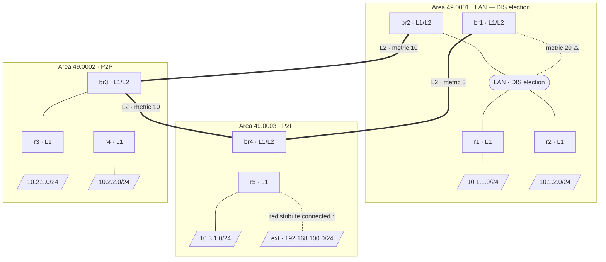

# netlab-isis-lab

[](https://codespaces.new/severindellsperger/netlab-isis-lab?machine=basicLinux32gb&devcontainer_path=.devcontainer/devcontainer.json)

A hands-on lab that uses [NetLab](https://netlab.tools) and [Containerlab](https://containerlab.dev) with [FRRouting (FRR)](https://frrouting.org) containers to demonstrate IS-IS multi-area routing, DIS election, pseudo-nodes, suboptimal inter-area routing, route leaking, and redistribution of external routes — all in a single reproducible topology.

---

## Lab Topology



> ⚠️ **Suboptimal routing highlighted:** `r1`/`r2` prefer `br2` as their L1 default gateway
> (lower L1 metric) but the shortest end-to-end path to Area 3 goes via `br1` (direct L2 link,
> metric 5). See the [Suboptimal Inter-Area Routing](#suboptimal-inter-area-routing) section for details
> and the [Route Leaking](#route-leaking--fixing-suboptimal-routing) section for the fix.

> **Note:** In IS-IS there is no concept of an ABR (Area Border Router — that is OSPF terminology).
> The routers participating in both L1 and L2 are simply called **L1/L2 routers** or **border routers** (`br1`–`br4`).

| Router | IS-IS Level | Area | Attached stub network |
|--------|-------------|------|-----------------------|
| `r1` | L1 only | 49.0001 | `10.1.1.0/24` |
| `r2` | L1 only | 49.0001 | `10.1.2.0/24` |
| `br1` | L1/L2 border | 49.0001 ↔ L2 | — |
| `br2` | L1/L2 border | 49.0001 ↔ L2 | — |
| `r3` | L1 only | 49.0002 | `10.2.1.0/24` |
| `r4` | L1 only | 49.0002 | `10.2.2.0/24` |
| `br3` | L1/L2 border | 49.0002 ↔ L2 | — |
| `r5` | L1 only | 49.0003 | `10.3.1.0/24` |
| `br4` | L1/L2 border | 49.0003 ↔ L2 | — |
| `ext` | **no IS-IS** | — (external host) | `192.168.100.0/24` *(redistributed from r5)* |

> **Note on IP addresses:** NetLab auto-assigns addresses from its default pools.
> Loopbacks use `10.0.0.x/32` and transit links use `172.16.x.x`. Run `netlab up`
> and inspect `netlab.yml` for the exact assigned addresses.

---

## IS-IS Concepts Explained

### Level-1 (L1) — Intra-area Routing

A **Level-1** router knows only about routers and prefixes *within its own area*.
It builds an intra-area **L1 LSDB** from:
- **Type 1 LSPs** (router LSPs) — one per router in the area, describing its links and reachable prefixes.
- **Type 2 LSPs** (pseudo-node LSPs) — generated by the DIS on multi-access LAN segments (see [DIS Election](#dis-election-and-the-pseudo-node)).

For destinations outside its area, an L1 router installs a **default route** pointing to the *nearest* L1/L2 router (the one with the lowest L1 metric). This is the root cause of suboptimal inter-area routing — the L1 router picks its exit point based only on the L1 metric to the border router, with no visibility into the inter-area topology beyond it.

```bash
# Show the L1 LSDB on r1 — contains only LSPs from Area 49.0001
netlab connect r1 -- vtysh -c "show isis database"

# Show detailed L1 LSDB entries
netlab connect r1 -- vtysh -c "show isis database detail"
```

### Level-2 (L2) — Inter-area (Backbone) Routing

The **L2 LSDB** is shared among *all* L1/L2 routers across every area. It describes the full inter-area topology — every area's prefixes, all L2 links, and their metrics. L2 forms the IS-IS backbone — unlike OSPF, there is no mandatory "area 0"; the backbone is simply the set of L2 adjacencies between L1/L2 border routers.

On an L1/L2 router (`br1`–`br4`) you can inspect both databases side by side:

```bash
# Show the L2 LSDB on br1 — contains LSPs from ALL areas
netlab connect br1 -- vtysh -c "show isis database level-2"

# Compare with the L1 LSDB (Area 49.0001 entries only)
netlab connect br1 -- vtysh -c "show isis database level-1"
```

### Level-1-2 (L1/L2) — Border Router

An **L1/L2** router participates in both levels simultaneously. It maintains:
- an **L1 LSDB** for its local area, and
- an **L2 LSDB** shared with all other L1/L2 routers.

It advertises a **default route** into its local area so that pure L1 routers can reach destinations in other areas. It also leaks (summarises) the L1 prefixes of its area into the L2 topology so that other areas can reach them.

### DIS Election and the Pseudo-Node

On a **multi-access LAN segment** (e.g., the Area 1 LAN in this lab), IS-IS elects a **Designated IS (DIS)**.

- **Election rule:** The router with the highest configured priority wins.  If priorities are equal, the highest SNPA (MAC address) wins.  There is no concept of a Backup DIS — the election is pre-emptive.
- **Role of the DIS:** The DIS generates a **pseudo-node LSP** (Type 2 LSP) that logically represents the LAN segment as a virtual node in the link-state database.  All routers on the LAN appear connected to this pseudo-node rather than to each other, which reduces the number of adjacencies that need to be tracked.
- **Flooding:** On a LAN, IS-IS still forms full adjacencies between every pair of routers (each router synchronises its LSDB with the DIS), but LSA flooding is coordinated by the DIS.

You can observe DIS election on the Area 1 LAN (`r1`, `r2`, `br1`, `br2`).  Areas 2 and 3 use point-to-point links — **no DIS election occurs** on P2P interfaces.

```bash
# Show IS-IS adjacencies on r1 (expect neighbours r2, br1, br2 on the LAN)
netlab connect r1 -- vtysh -c "show isis neighbor"

# Show IS-IS database on r1 — look for a pseudo-node LSP (Type 2)
netlab connect r1 -- vtysh -c "show isis database detail"
```

### Suboptimal Inter-Area Routing

This lab deliberately demonstrates a classic IS-IS pitfall.

The Area 1 LAN has **two** L1/L2 border routers with deliberately different L1 metrics:

| Router | L1 metric on Area 1 LAN | L2 path to Area 3 (49.0003) | Total cost |
|--------|--------------------------|------------------------------|------------|
| `br2` | **10** ← preferred by r1/r2 | `br2 → br3 → br4` | 10 + 10 + 10 = **30** |
| `br1` | 20 (higher, less preferred) | `br1 → br4` (direct) | 20 + 5 = **25** ✅ |

Because `r1` and `r2` see a lower **L1** metric to `br2`, they install a default route via `br2`. Traffic destined for `10.3.1.0/24` (Area 3) therefore travels the *longer* path:

```
r1 → br2 → br3 → br4 → r5   (total IS-IS cost: 30)
```

The optimal path is:

```
r1 → br1 → br4 → r5          (total IS-IS cost: 25)
```

`r1` cannot discover this because it has no L2 LSDB — it only knows the L1 metric to its nearest border router.

```bash
# Verify the suboptimal default route on r1 — next-hop should be br2
netlab connect r1 -- vtysh -c "show ip route isis"

# Traceroute from r1 to the Area 3 stub network to observe the longer path
netlab connect r1 -- vtysh -c "show ip route 10.3.1.0/24"
```

### Route Leaking — Fixing Suboptimal Routing

**Route leaking** (also called *L2-to-L1 redistribution*) pushes specific L2 prefixes back into an L1 area as L1 routes. Once `r1` and `r2` have a *specific* L1 route to `10.3.1.0/24` via `br1`, they can compare its total cost against the same prefix via `br2` and select the optimal path.

#### Step 1 — Observe the problem (before leaking)

```bash
# On r1: only a default route exists — no specific route to Area 3
netlab connect r1 -- vtysh -c "show ip route isis"
# Expected output includes:  i*L1 0.0.0.0/0 via <br2-ip>

# Trace the actual path to 10.3.1.1
netlab connect r1 -- traceroute 10.3.1.1
# Expected: r1 → br2 → br3 → br4 → r5  (suboptimal)
```

#### Step 2 — Configure route leaking on br1

Connect to `br1` and enter the following FRR configuration:

```bash
netlab connect br1 vtysh
```

```
configure terminal

!-- Prefix-list matching the Area 3 stub network
ip prefix-list AREA3_PREFIXES seq 5 permit 10.3.1.0/24

!-- Route-map that permits matched prefixes
route-map LEAK_AREA3 permit 10
 match ip address prefix-list AREA3_PREFIXES
!

!-- Inside the IS-IS process: leak matching L2 routes into L1
router isis 1
 redistribute isis level-2 into level-1 route-map LEAK_AREA3
!

end
write memory
```

#### Step 3 — Verify the fix (after leaking)

```bash
# On r1: a specific L1 route to 10.3.1.0/24 should now appear via br1
netlab connect r1 -- vtysh -c "show ip route 10.3.1.0/24"
# Expected:  i L1 10.3.1.0/24 via <br1-ip>  [115/25]

# Trace the path again — should now go via br1 (shorter)
netlab connect r1 -- traceroute 10.3.1.1
# Expected: r1 → br1 → br4 → r5  (optimal)
```

The leaked specific route is preferred over the default route due to **longest prefix match** — a `/24` beats `0.0.0.0/0`. Traffic to `10.3.1.0/24` will now follow the optimal path through `br1`.

---

### Redistributing External Routes into IS-IS

#### Background

IS-IS, like OSPF, is a **link-state IGP** — it only knows about routers and prefixes that are explicitly part of the IS-IS domain.  Any network attached to a router that is *not* configured as an IS-IS passive interface, and *not* reachable via another IS-IS router, will be invisible to the rest of the domain.

In this lab the Linux host `ext` is connected to `r5` via the `192.168.100.0/24` subnet.  `ext` does **not** run IS-IS (or any routing protocol).  Until redistribution is configured on `r5`, no other router in the lab can reach `192.168.100.0/24` — it simply does not appear in any LSDB.

Redistribution solves this: `r5` imports the connected prefix into IS-IS and advertises it in its own LSP, making the external network reachable from every area.

#### When is redistribution needed?

- Connecting IS-IS to a non-IS-IS network (e.g., a server segment, a management network, or a legacy subnet).
- Importing prefixes from another routing protocol (e.g., `redistribute bgp` or `redistribute static`).
- Making a directly attached network reachable without turning it into a passive IS-IS interface (useful when you do not want IS-IS hello packets on that interface).

#### Step 1 — Observe the problem (before redistribution)

```bash
# On r1: verify that 192.168.100.0/24 is NOT present
netlab connect r1 -- vtysh -c "show ip route 192.168.100.0/24"
# Expected: % Network not in table

# On r5: the prefix IS in the routing table as a connected route
netlab connect r5 -- vtysh -c "show ip route connected"
# Expected:  C   192.168.100.0/24 is directly connected, <interface>

# But it is absent from the IS-IS LSDB
netlab connect r5 -- vtysh -c "show isis database detail"
# 192.168.100.0/24 will NOT appear in r5's LSP
```

#### Step 2 — Configure redistribution on r5

Connect to `r5` and enter the following FRR configuration:

```bash
netlab connect r5 vtysh
```

```
configure terminal

!-- (Optional) restrict redistribution to the specific external prefix only
ip prefix-list EXT_NETWORKS seq 5 permit 192.168.100.0/24

route-map REDIST_CONNECTED permit 10
 match ip address prefix-list EXT_NETWORKS
!

!-- Redistribute connected routes into IS-IS (Level-1, since r5 is L1 only)
router isis 1
 redistribute connected route-map REDIST_CONNECTED
!

end
write memory
```

> **Note:** `r5` is a Level-1 router, so the redistributed prefix is announced in the L1 LSDB of Area 49.0003.  `br4` (the L1/L2 border router) will automatically promote it into the L2 LSDB, making it reachable from all other areas.

#### Step 3 — Verify the fix (after redistribution)

```bash
# On r5: the LSP now includes 192.168.100.0/24
netlab connect r5 -- vtysh -c "show isis database detail"
# Look for:  IP Reachability: 192.168.100.0/24

# On r1 (different area): the external prefix should now be reachable
netlab connect r1 -- vtysh -c "show ip route 192.168.100.0/24"
# Expected:  i L2 192.168.100.0/24 via <br1-or-br2-ip>  [115/...]

# Connectivity test from r1 to the external host
netlab connect r1 -- ping 192.168.100.1 -c 5
```

> **Redistribution vs. passive interface:** A passive IS-IS interface also advertises a connected prefix into IS-IS, but it still sends IS-IS hello packets on the interface (and can form adjacencies if another IS-IS router is present). Redistribution via `redistribute connected` makes the prefix visible in IS-IS **without** enabling IS-IS on that interface at all — which is the correct choice for a host-facing segment like the one toward `ext`.

---

## Prerequisites

> **Tip:** You can skip local setup entirely by launching the lab in [GitHub Codespaces](#-launch-in-github-codespaces) — all dependencies are pre-installed in the dev container.

### 1. Install NetLab

Follow the official installation guide:
👉 **https://netlab.tools/install/**

### 2. Clone this repository

```bash
git clone https://github.com/severindellsperger/netlab-isis-lab.git
cd netlab-isis-lab
```

---

## 🚀 Launch in GitHub Codespaces

Click the button below to open this lab in a pre-configured cloud environment — no local installation required:

[](https://codespaces.new/severindellsperger/netlab-isis-lab?machine=basicLinux32gb&devcontainer_path=.devcontainer/devcontainer.json)

Once the Codespace is ready, run `netlab up` in the terminal to start the lab.

---

## Starting the Lab

```bash
netlab up
```

`netlab up` will:
1. Parse `topology.yml` and auto-assign IP addresses and IS-IS parameters.
2. Generate Containerlab and FRR configuration files.
3. Start all containers via Containerlab.
4. Deploy the generated FRR configuration to every container.

After a few seconds, IS-IS adjacencies should form and the routing tables converge.

```bash
# Show IS-IS neighbours on br1
netlab connect br1 -- vtysh -c "show isis neighbor"

# Show IS-IS database (LSDB) on r1 — note the pseudo-node LSPs
netlab connect r1 -- vtysh -c "show isis database"

# Show the routing table on r1 (expect a default route via br2)
netlab connect r1 -- vtysh -c "show ip route isis"

# Ping a host in the Area 3 customer network from r1
netlab connect r1 -- ping 10.3.1.1 count 5
```

You can also open an interactive vtysh shell on any device:

```bash
netlab connect r1 vtysh
```

Or connect directly via Docker (container names follow the pattern `clab-<lab-name>-<node>`; run `docker ps` to confirm the exact names for your environment):

```bash
docker exec -it clab-netlab-isis-lab-r1 vtysh
```

---

## Stopping the Lab

```bash
netlab down
```

`netlab down` destroys all containers and removes generated configuration files, leaving the repository in a clean state.

---

## License

This lab is provided as-is for educational purposes.
