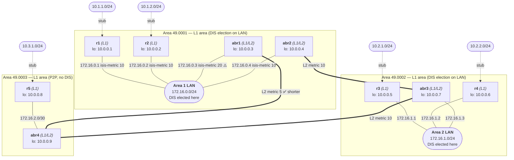

# netlab-isis-lab

[](https://codespaces.new/severindellsperger/netlab-isis-lab?machine=basicLinux32gb&devcontainer_path=.devcontainer/devcontainer.json)

A hands-on lab that uses [NetLab](https://netlab.tools) and [Containerlab](https://containerlab.dev) with [FRRouting (FRR)](https://frrouting.org) containers to demonstrate IS-IS multi-area routing, DIS election, pseudo-nodes, suboptimal inter-area routing, and route leaking — all in a single reproducible topology.

---

## Lab Topology



> **Note on IP addresses:** NetLab auto-assigns addresses from its default pools.
> Loopbacks use `10.0.0.x/32`, transit LAN segments use `172.16.x.0/24`, and
> P2P links use `172.16.x.0/30`. The values shown above are representative;
> run `netlab up` and inspect `netlab.yml` for the exact addresses.

| Router | IS-IS Role | Area |
|--------|-----------|------|
| `r1` | Level-1 (intra-area only) | 49.0001 |
| `r2` | Level-1 (intra-area only) | 49.0001 |
| `abr1` | Level-1-2 (border router) | 49.0001 ↔ L2 |
| `abr2` | Level-1-2 (border router) | 49.0001 ↔ L2 |
| `r3` | Level-1 (intra-area only) | 49.0002 |
| `r4` | Level-1 (intra-area only) | 49.0002 |
| `abr3` | Level-1-2 (border router) | 49.0002 ↔ L2 |
| `r5` | Level-1 (intra-area only) | 49.0003 |
| `abr4` | Level-1-2 (border router) | 49.0003 ↔ L2 |

---

## IS-IS Concepts Explained

### Level-1 (L1) — Intra-area Routing

A **Level-1** router knows only about routers and prefixes *within its own area*.
It builds an intra-area LSDB from Type 1 LSPs (router LSPs) and Type 2 LSPs (pseudo-node LSPs) that originate inside the same area.

For destinations outside its area, an L1 router installs a **default route** pointing to the *nearest* L1/L2 router (the one with the lowest L1 metric).  This is a critical point: the L1 router has no knowledge of the inter-area topology and simply trusts its closest border router.

### Level-2 (L2) — Inter-area (Backbone) Routing

A **Level-2** router exchanges routing information with other L2 or L1/L2 routers across *all* areas.  L2 forms the IS-IS backbone — there is no mandatory "area 0" as in OSPF; the backbone is simply the set of L2 adjacencies between L1/L2 border routers.

### Level-1-2 (L1/L2) — Border Router

An **L1/L2** router participates in both levels simultaneously.  It maintains:
- an **L1 LSDB** for its local area, and
- an **L2 LSDB** shared with all other L1/L2 routers.

It advertises a **default route** into its local area so that pure L1 routers can reach destinations in other areas.  It also summarises the L1 prefixes of its area into the L2 topology.

### DIS Election and the Pseudo-Node

On a **multi-access LAN segment** (e.g., the Area 1 or Area 2 LAN in this lab), IS-IS elects a **Designated IS (DIS)**.

- **Election rule:** The router with the highest configured priority wins.  If priorities are equal, the highest SNPA (MAC address) wins.  There is no concept of a Backup DIS — the election is pre-emptive.
- **Role of the DIS:** The DIS generates a **pseudo-node LSP** (Type 2 LSP) that logically represents the LAN segment as a virtual node in the link-state database.  All routers on the LAN appear connected to this pseudo-node rather than to each other, which reduces the number of adjacencies that need to be tracked.
- **Flooding:** On a LAN, IS-IS still forms full adjacencies between every pair of routers (each router synchronises its LSDB with the DIS), but LSA flooding is coordinated by the DIS.

You can observe DIS election on the Area 1 LAN (`r1`, `r2`, `abr1`, `abr2`) and the Area 2 LAN (`r3`, `r4`, `abr3`).  The Area 3 link (`r5` ↔ `abr4`) is a point-to-point link — **no DIS election occurs** on P2P interfaces.

```bash
# Show IS-IS adjacencies on r1 (expect neighbours r2, abr1, abr2 on the LAN)
netlab connect r1 -- vtysh -c "show isis neighbor"

# Show IS-IS database on r1 — look for a pseudo-node LSP (Type 2)
netlab connect r1 -- vtysh -c "show isis database detail"
```

### Suboptimal Inter-Area Routing

This lab deliberately demonstrates a classic IS-IS pitfall.

The Area 1 LAN has two L1/L2 border routers:

| Router | L1 metric on Area 1 LAN | L2 path to Area 3 (49.0003) |
|--------|--------------------------|------------------------------|
| `abr2` | **10** (preferred by r1/r2) | `abr2 → abr3 → abr4` (cost 20) |
| `abr1` | 20 (higher, less preferred) | `abr1 → abr4` (cost 5) ✅ |

Because `r1` and `r2` see a lower **L1** metric to `abr2`, they install a default route via `abr2`.  Traffic destined for the customer network `10.3.1.0/24` in Area 3 therefore travels:

```
r1 → abr2 → abr3 → abr4 → r5   (total cost: 10 + 10 + 10 = 30)
```

The optimal path would be:

```
r1 → abr1 → abr4 → r5          (total cost: 20 + 5 = 25)
```

The L1 router cannot discover this because it has no visibility into the L2 topology.

```bash
# Verify suboptimal default route on r1 — should point to abr2 (172.16.0.4)
netlab connect r1 -- vtysh -c "show ip route 0.0.0.0/0 isis"

# Check the full routing table on r1
netlab connect r1 -- vtysh -c "show ip route isis"
```

### Route Leaking — Fixing Suboptimal Routing

**Route leaking** is the mechanism of redistributing specific L2 (inter-area) prefixes *back into* an L1 area.  When `abr1` leaks the route to `10.3.1.0/24` into Area 1 as an L1 prefix, routers `r1` and `r2` receive a *specific* route (not just a default) and can select the correct next hop based on metric.

The following FRR commands configure route leaking on `abr1`:

```bash
# Connect to abr1
netlab connect abr1 vtysh

# Inside vtysh on abr1:
configure terminal
router isis 1
  redistribute isis level-2 into level-1 route-map LEAK_AREA3
!
route-map LEAK_AREA3 permit 10
  match ip address prefix-list AREA3_PREFIXES
!
ip prefix-list AREA3_PREFIXES seq 5 permit 10.3.1.0/24
end
write memory
```

After leaking, verify on `r1`:

```bash
# r1 should now have a specific L1 route to 10.3.1.0/24 via abr1
netlab connect r1 -- vtysh -c "show ip route 10.3.1.0/24"
```

The specific leaked route will be preferred over the default route, and traffic to `10.3.1.0/24` will now follow the optimal path via `abr1`.

---

## Prerequisites

> **Tip:** You can skip local setup entirely by launching the lab in [GitHub Codespaces](#-launch-in-github-codespaces) — all dependencies are pre-installed in the dev container.

### 1. Install NetLab

Follow the official installation guide:
👉 **https://netlab.tools/install/**

### 2. Clone this repository

```bash
git clone https://github.com/severindellsperger/netlab-isis-lab.git
cd netlab-isis-lab
```

---

## 🚀 Launch in GitHub Codespaces

Click the button below to open this lab in a pre-configured cloud environment — no local installation required:

[](https://codespaces.new/severindellsperger/netlab-isis-lab?machine=basicLinux32gb&devcontainer_path=.devcontainer/devcontainer.json)

Once the Codespace is ready, run `netlab up` in the terminal to start the lab.

---

## Starting the Lab

```bash
netlab up
```

`netlab up` will:
1. Parse `topology.yml` and auto-assign IP addresses and IS-IS parameters.
2. Generate Containerlab and FRR configuration files.
3. Start all containers via Containerlab.
4. Deploy the generated FRR configuration to every container.

After a few seconds, IS-IS adjacencies should form and the routing tables converge.

```bash
# Show IS-IS neighbours on abr1
netlab connect abr1 -- vtysh -c "show isis neighbor"

# Show IS-IS database (LSDB) on r1 — note the pseudo-node LSPs
netlab connect r1 -- vtysh -c "show isis database"

# Show the routing table on r1 (expect a default route via abr2)
netlab connect r1 -- vtysh -c "show ip route isis"

# Ping a host in the Area 3 customer network from r1
netlab connect r1 -- ping 10.3.1.1 count 5
```

You can also open an interactive vtysh shell on any device:

```bash
netlab connect r1 vtysh
```

Or connect directly via Docker (container names follow the pattern `clab-<lab-name>-<node>`; run `docker ps` to confirm the exact names for your environment):

```bash
docker exec -it clab-netlab-isis-lab-r1 vtysh
```

---

## Stopping the Lab

```bash
netlab down
```

`netlab down` destroys all containers and removes generated configuration files, leaving the repository in a clean state.

---

## License

This lab is provided as-is for educational purposes.
